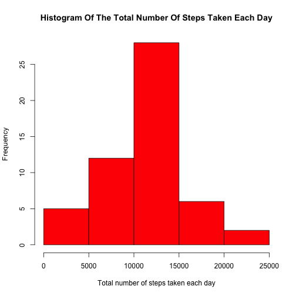
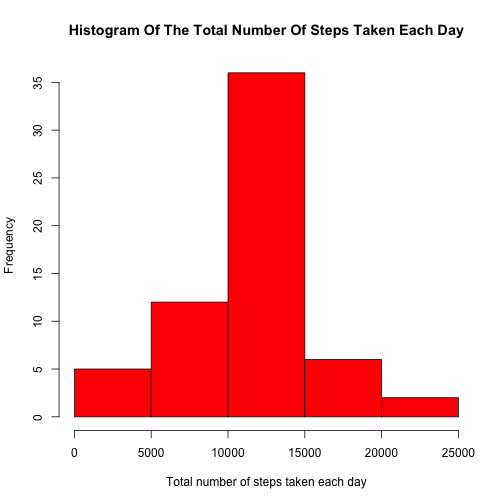

## Loading and preprocessing the data
1. **loading Data and creat the data frame "activityData"**

```r
fileUrl= "https://d396qusza40orc.cloudfront.net/repdata%2Fdata%2Factivity.zip"
if (!file.exists("./repdata_data_activity.zip")) {
        download.file(fileUrl, destfile = "./repdata_data_activity.zip")
   }
activityData <- read.csv(unz("repdata_data_activity.zip", "activity.csv"), header=T)
```
2. **Display the properties of activityData** 

```r
str(activityData)
```

```
## 'data.frame':	17568 obs. of  3 variables:
##  $ steps   : int  NA NA NA NA NA NA NA NA NA NA ...
##  $ date    : Factor w/ 61 levels "2012-10-01","2012-10-02",..: 1 1 1 1 1 1 1 1 1 1 ...
##  $ interval: int  0 5 10 15 20 25 30 35 40 45 ...
```
3. **Display the head of  activityData** 

```r
head(activityData)
```

```
##   steps       date interval
## 1    NA 2012-10-01        0
## 2    NA 2012-10-01        5
## 3    NA 2012-10-01       10
## 4    NA 2012-10-01       15
## 5    NA 2012-10-01       20
## 6    NA 2012-10-01       25
```


## What is mean total number of steps taken per day?
1. **Histogram of the total number of steps taken each day (missing values ignored)**

```r
dailyActivityData <-aggregate(formula = steps~date, data = activityData,FUN = sum, na.rm=TRUE)
hist(dailyActivityData$steps, freq=TRUE, xlab = " Total number of steps taken each day ",main="Histogram Of The Total Number Of Steps Taken Each Day", col="red")
```

 

2. **Calculate and report the mean and median total number of steps taken per day**

```r
  meanTotal<-as.integer(round(mean(dailyActivityData$steps)))
  meanTotal
```

```
## [1] 10766
```
mean total number of steps taken per day is 10766.

```r
  medianTotal<-median(dailyActivityData$steps)
  medianTotal
```

```
## [1] 10765
```
median total number of steps taken per day is 10765.

## What is the average daily activity pattern?
1. **Make a time series plot (i.e. type = "l") of the 5-minute interval (x-axis) and the average number of steps taken, averaged across all days (y-axis)**

```r
aveDailyActivityPatternData<-aggregate(formula = steps~interval, data = activityData,FUN = mean, na.rm=TRUE)
plot(aveDailyActivityPatternData$interval, aveDailyActivityPatternData$steps,
     type = "l",main="Time Seies Plot of The 5-minute Interval And The Average Number\n Of Steps Taken(Averaged Across All Days)", 
     xlab="5-minute Interval",
     ylab="The Average Number Of Steps Taken")
```

 

2.**Which 5-minute interval, on average across all the days in the dataset, contains the maximum number of steps?**

```r
max_index = which.max(aveDailyActivityPatternData$steps)
max_interval=aveDailyActivityPatternData$interval[max_index]
```
The 104th 5-minute interval 835, on average across all the days in the dataset, contains the maximum number of steps.

## Imputing missing values
Note that there are a number of days/intervals where there are missing values (coded as NA). The presence of missing days may introduce bias into some calculations or summaries of the data.

1. **Calculate and report the total number of missing values in the dataset (i.e. the total number of rows with NAs)**

```r
totalNumNAs <- sum(!complete.cases(activityData))
```
The total number of missing values in the dataset  is 2304.

```r
stepsNumNAs <- sum(is.na(activityData$steps))
dateNumNAs <- sum(is.na(activityData$date))
intervalNumNAs <- sum(is.na(activityData$interval))
```
Since the total number of missing values in steps is 2304, which is equal to the total number of missing values in the dataset, the total number of missing values in date is 0,
and  the total number of missing values in interval is 0,then all the missing values in the dataset come from steps

2. **Devise a strategy for filling in all of the missing values in the dataset. The strategy does not need to be sophisticated. For example, you could use the mean/median for that day, or the mean for that 5-minute interval, etc.**

The mean for that 5-minute interval will be used to fill in all of the missing values in the steps.

3. **Create a new dataset that is equal to the original dataset but with the missing data filled in.**

```r
aveDailyActivityPatternData$imputedSteps <- floor(aveDailyActivityPatternData$steps)
imputedActivityData <- merge(activityData,
                             aveDailyActivityPatternData[,c('interval', 'imputedSteps')],
                              by='interval')
imputedActivityData$steps <- ifelse(is.na(imputedActivityData$steps),
                                 imputedActivityData$imputedSteps,
                                 imputedActivityData$steps)
imputedActivityData$imputedSteps <- NULL
```


4. **Make a histogram of the total number of steps taken each day and Calculate and report the mean and median total number of steps taken per day. Do these values differ from the estimates from the first part of the assignment? What is the impact of imputing missing data on the estimates of the total daily number of steps?**

Histogram of the total number of steps taken each day after imputed

```r
dailyActivityData <-aggregate(formula = steps~date, data = imputedActivityData,FUN = sum, na.rm=TRUE)
hist(dailyActivityData$steps, freq=TRUE, xlab = " Total number of steps taken each day ",main="Histogram Of The Total Number Of Steps Taken Each Day", col="red")
```

 


```r
  meanTotal2<-as.integer(round(mean(dailyActivityData$steps)))
  meanTotal2
```

```
## [1] 10750
```
mean total number of steps taken per day is 10750.


```r
  medianTotal2<-as.integer(round(median(dailyActivityData$steps)))
  medianTotal2
```

```
## [1] 10641
```
median total number of steps taken per day is 10641.

These values differ from the estimates from the first part of the assignment.

The impact of imputing missing data on the estimates of the total daily number of steps:

Both the mean and median total number of steps taken decrease.


## Are there differences in activity patterns between weekdays and weekends?
For this part the weekdays() function may be of some help here. Use the dataset with the filled-in missing values for this part.

1.**Create a new factor variable in the dataset with two levels – “weekday” and “weekend” indicating whether a given date is a weekday or weekend day.**


```r
  daytype <- function(date) {
    if (weekdays(as.Date(date)) %in% c("Saturday", "Sunday")) {
        "weekend"
    } else {
        "weekday"
    }
}
imputedActivityData$daytype <- as.factor(sapply(imputedActivityData$date, daytype))
```

2.**Make a panel plot containing a time series plot (i.e. type = "l") of the 5-minute interval (x-axis) and the average number of steps taken, averaged across all weekday days or weekend days (y-axis).**

```r
par(mfrow = c(2, 1))
for (type in c("weekend", "weekday")) {
    dayTypeActivityData<- aggregate(steps ~ interval, data = imputedActivityData,
                        subset = imputedActivityData$daytype ==type, FUN = mean)
    plot( dayTypeActivityData, type = "l", main = type, ylim=c(0,250))
}
```

 


